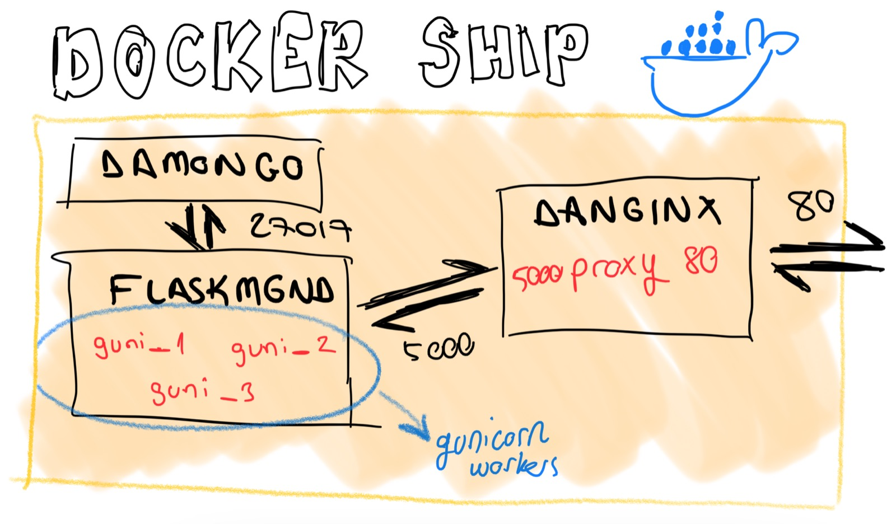

# **flaskmgnd** - Flask Mongo Gunicorn Nginx Docker

This is a flask rest api project which is already configured for `gunicorn` and `nginx`. Also it is ready to be deployed as a `Docker` container and it works with a `MongoDB` instance, has the `Swagger` integration.

You can use it as the initializer project of your simple microservices without configuration and deployment pain. You will find very useful built-in features in it. Take a look at [features](docs/features.md)!!!.

----------

## **Run**
This project works with python3.8. You will need to install python3.8 and requirements in `requirements.txt`.

```shell
pip3 install -r requirements.txt
```

You need an MongoDB instance running. You can use the docker image `mongo` to start a MongoDB instance.
```shell
docker run -d --name damongo -e MONGO_INITDB_ROOT_USERNAME=admin -e MONGO_INITDB_ROOT_PASSWORD=1234 -p 27017:27017 --restart unless-stopped mongo
```

Now, you can run the project in your local by running the `run_flask.sh` script for simple werkzeug server or by running the `run_guni.sh` script for gunicorn.

----------

## **Docker**



You can find the flaskmgnd and danginx containers' docker files at `build/`. You can build them by running command:

```shell
cd build/
docker-compose build
```

Then you can run these composed containers by running simply:
```shell
cd build/
docker-compose up
```